# Tsuru
Segue abaixo as instruções para criar um Tsuru, fácil e rápido:

### 1° Passo:
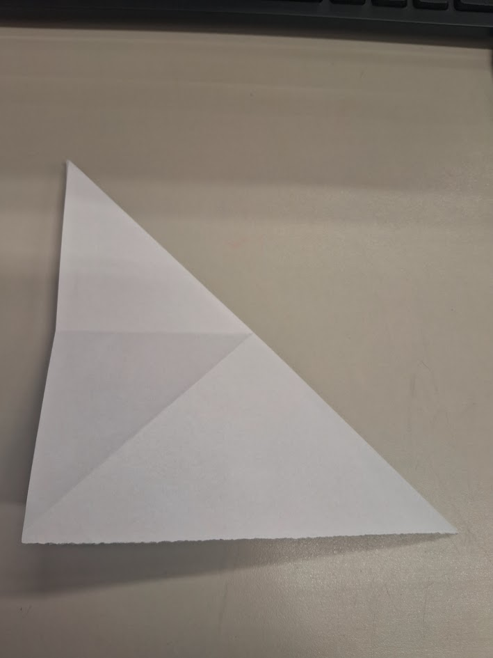

### 2° Passo:
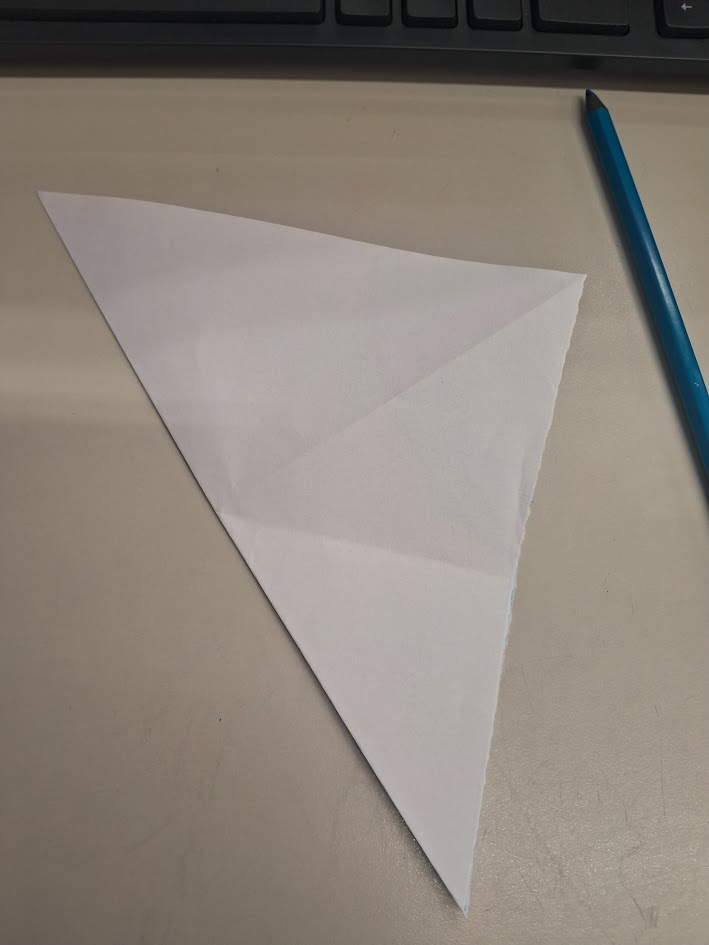

### 3° Passo:
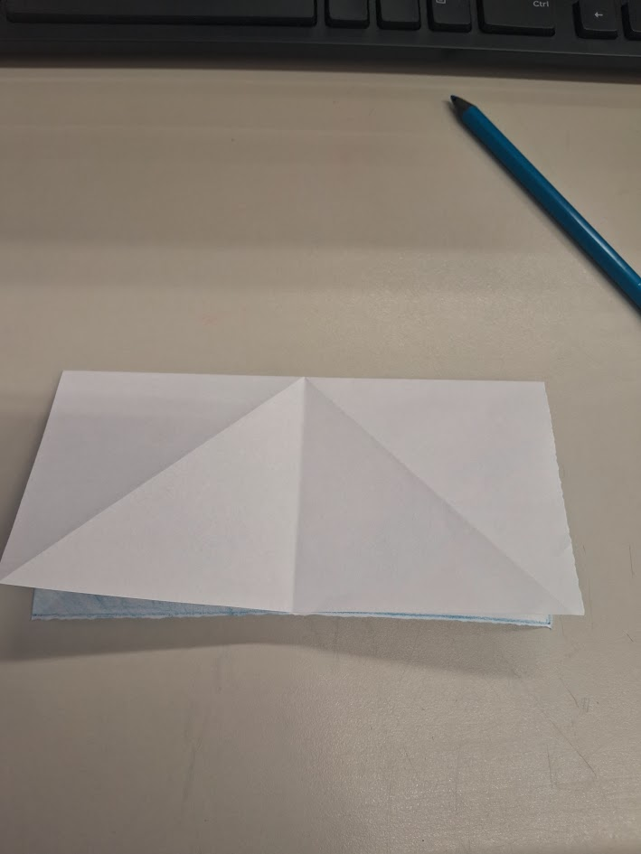

### 4° Passo:
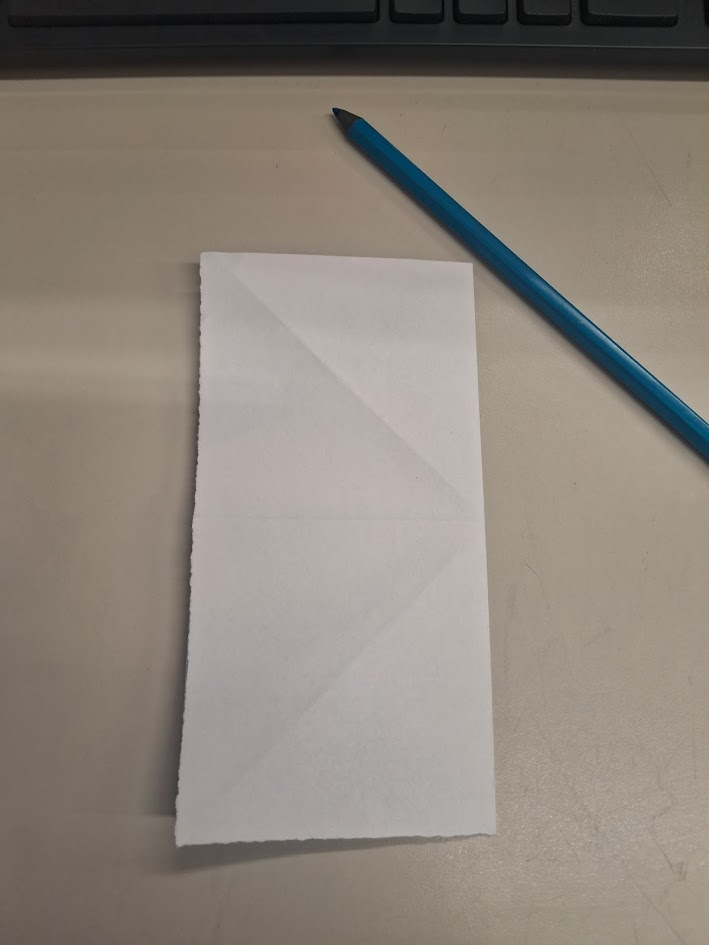

### 5° Passo:
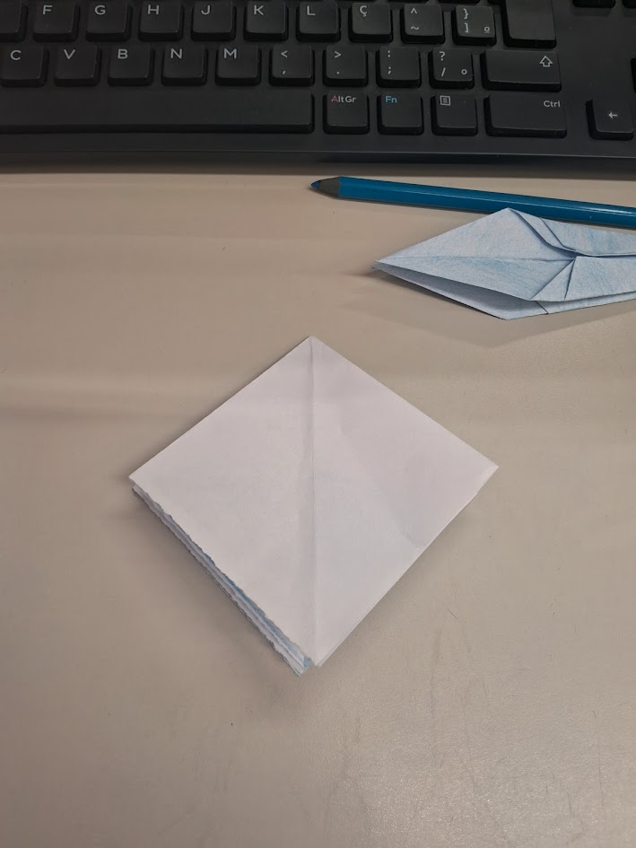

### 6° Passo:

### 7° Passo:
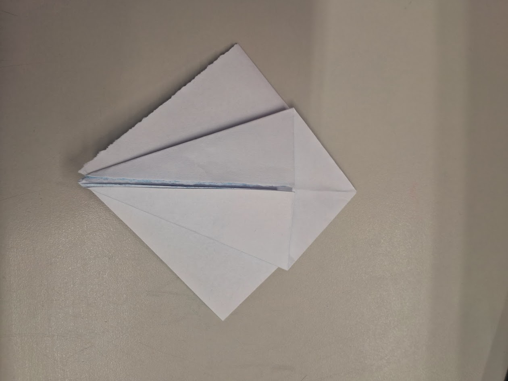

### 8° Passo:
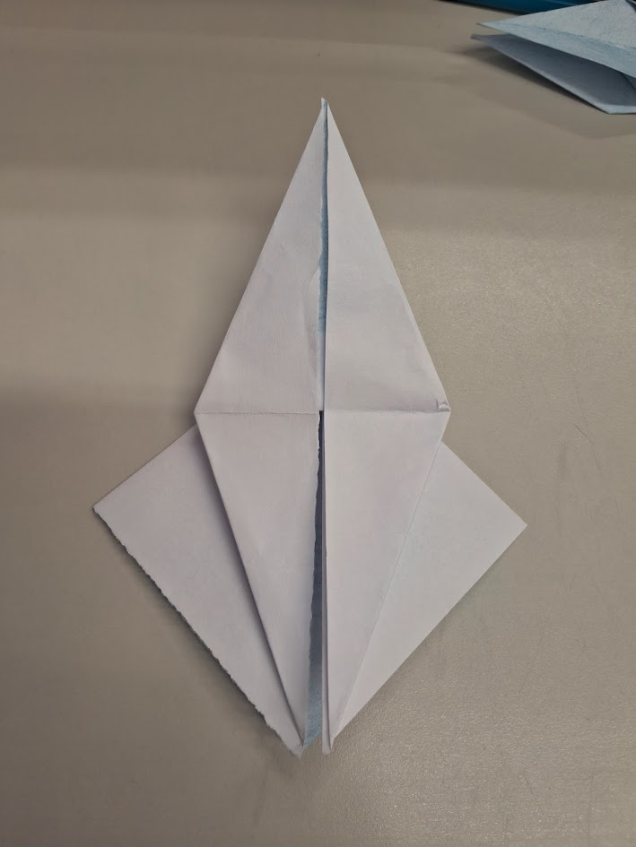

### 9° Passo:

### 10° Passo:
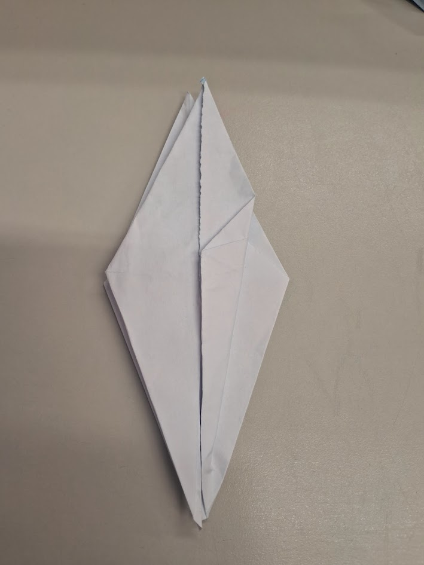

### 11° Passo:

### 12° Passo:
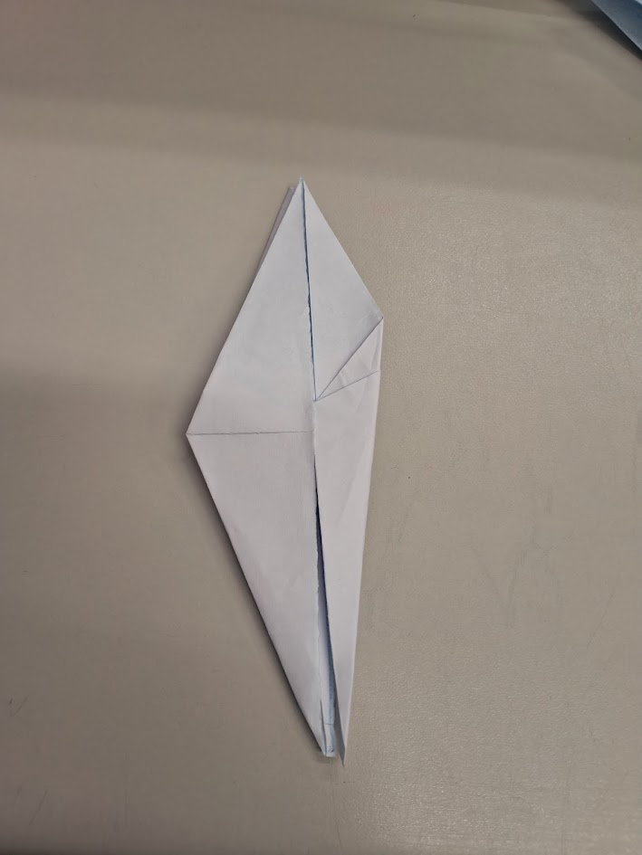

### 13° Passo:
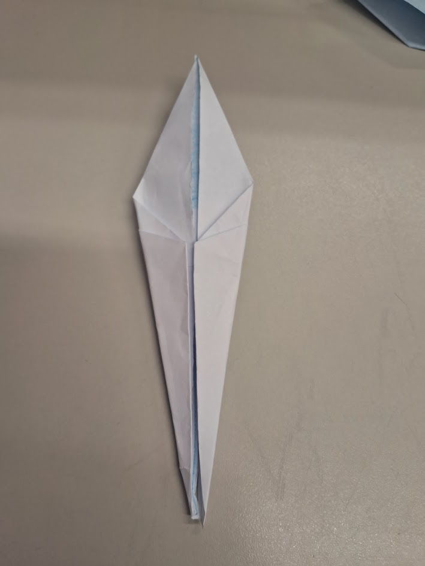

### 14° Passo:
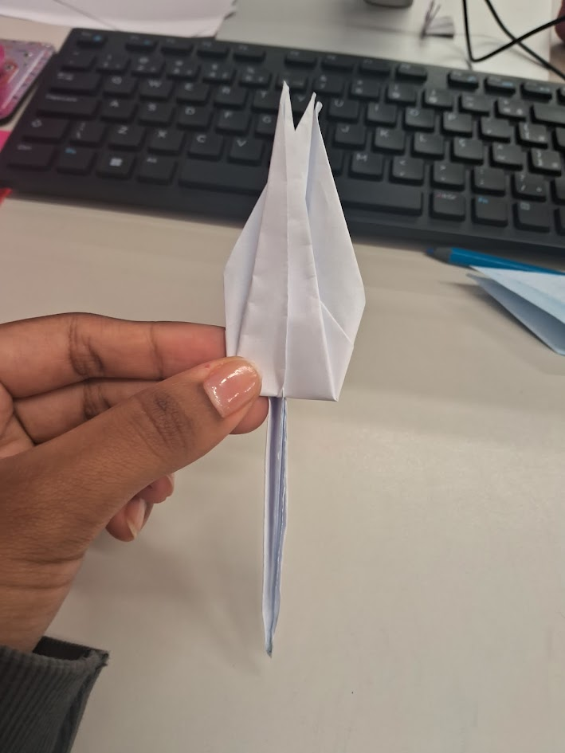

### 15° Passo:

### 16° Passo:

### 17° Passo: 

### 18° Passo:
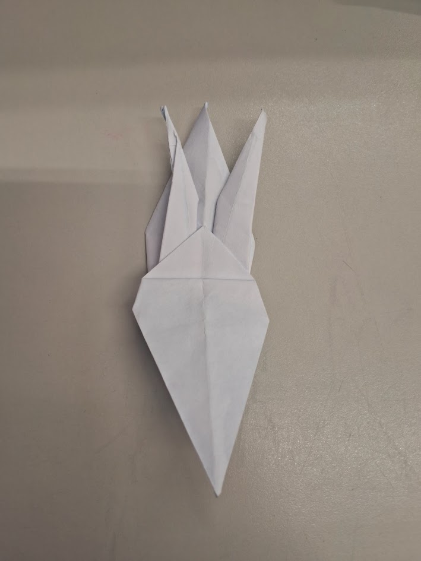

### 19° Passo:
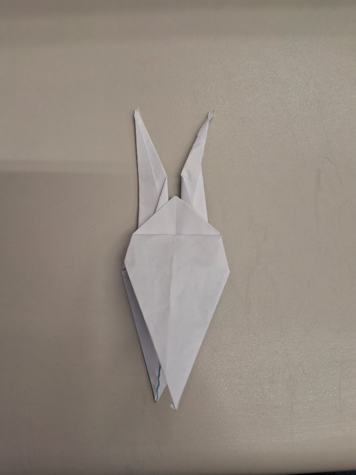

### 20° Passo:
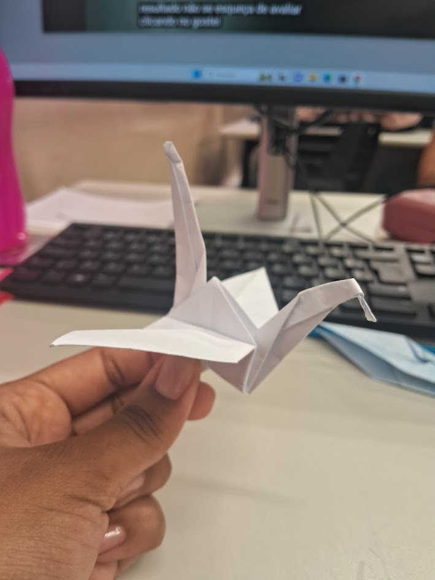

# Parabéns você concluiu o tutorial! Para personalizar seu Tsuru, utilize a imaginação e faça seu melhor origami. 