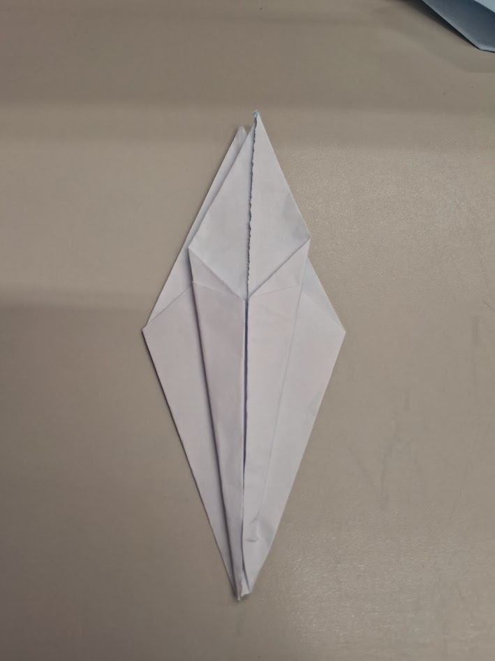
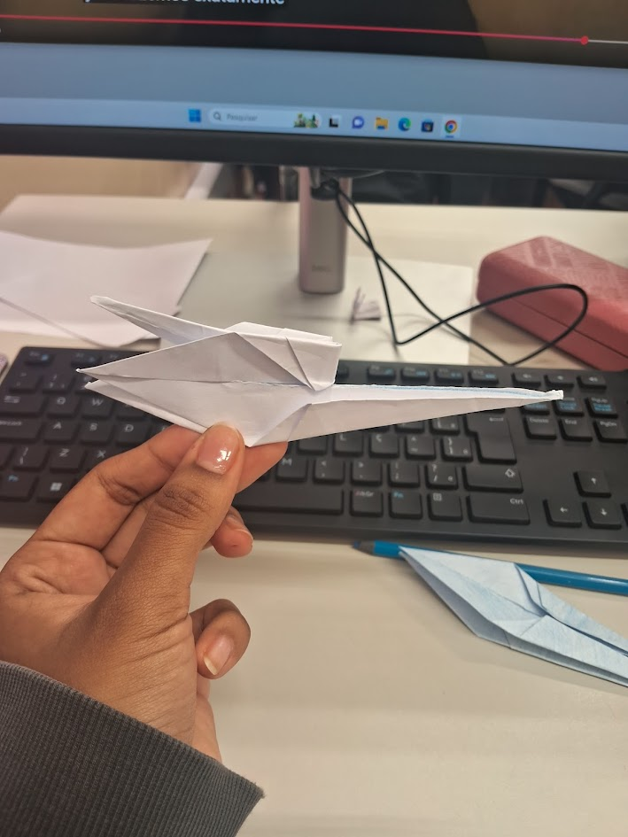
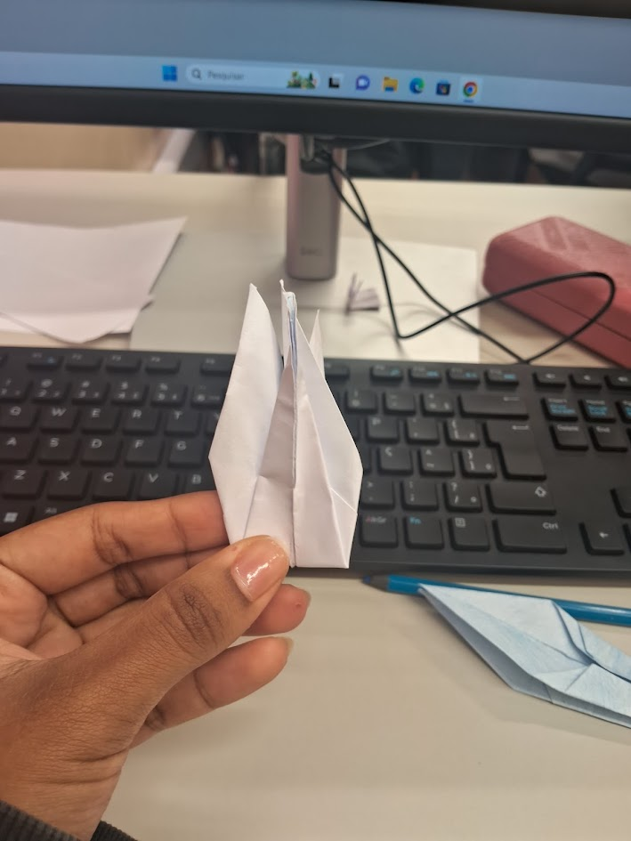

# Tsuru
Segue abaixo as instruções para criar um Tsuru, fácil e rápido:

### 1° Passo:

### 2° Passo:

### 3° Passo:

### 4° Passo:

### 5° Passo:

### 6° Passo:

### 7° Passo:

### 8° Passo:

### 9° Passo:

### 10° Passo:

### 11° Passo:

### 12° Passo:

### 13° Passo:

### 14° Passo:

### 15° Passo:

### 16° Passo:

### 17° Passo: 

### 18° Passo:

### 19° Passo:

### 20° Passo:

# Parabéns você concluiu o tutorial! Para personalizar seu Tsuru, utilize a imaginação e faça seu melhor origami. 